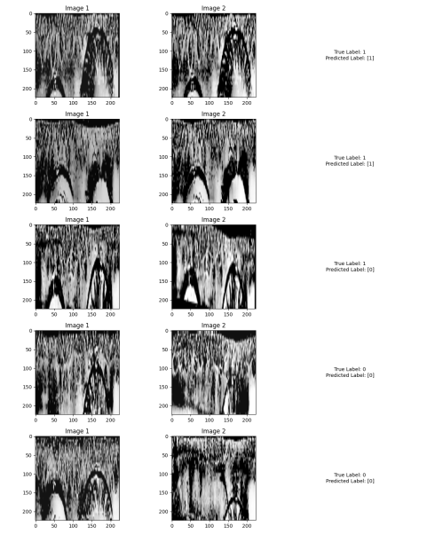

# Iris Recognition 
## Overview
This project aims to develop an iris recognition system utilizing a Siamese Neural Network architecture. Siamese networks are widely used for tasks involving similarity learning, making them suitable for tasks like iris recognition. The CNN used were pre-trained VGG16 and ResNet50, to extract features from segmented and normalized iris images. 

## Dataset
IITD dataset was used for the project which consisted of eye images of 224 individuals. The dataset consists of folders with people ID (001-224) which contains grayscale eye images (left or right or both). Through augmentation techniques, about 20,000 pairs were generated.
## Predictions

## Refrences
https://papers.ssrn.com/sol3/papers.cfm?abstract_id=3735924

https://viso.ai/deep-learning/vgg-very-deep-convolutional-networks/
